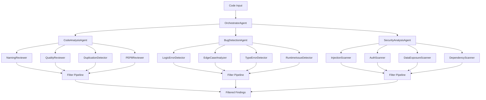

# Multi-Agent Code Review and Debugging Network

[](https://www.python.org/downloads/)
[](https://opensource.org/licenses/MIT)
[](https://langchain-ai.github.io/langgraph/)

A production-grade multi-agent system powered by **12 specialized AI agents** for automated code review, bug detection, and security analysis. Inspired by [Ellipsis.dev](https://www.ellipsis.dev/blog/how-we-built-ellipsis), featuring a multi-stage pipeline with filtering, parallel execution, and LangGraph workflow orchestration.

---

## 🌟 Highlights

- **12 Specialized Sub-Agents**: Each focuses on one aspect (naming, security injection, edge cases, etc.)
- **Multi-Stage Pipeline**: Generation → Filtering → Consolidation
- **Filter Pipeline**: Deduplication, confidence filtering, and hallucination detection
- **LangGraph Workflows**: Stateful orchestration with automatic error recovery
- **Parallel Execution**: 4x faster via ThreadPoolExecutor
- **GitHub Integration**: Automated PR reviews with inline comments
- **Multiple LLM Support**: Qwen (local), OpenAI, Bytez
- **Web File Support**: Analyzes HTML, CSS, JSON, XML, and shell scripts
- **Production Ready**: Confidence scoring, evidence-based findings, graceful degradation

---

## 🏗️ Architecture

### Specialized Agent System



### The 12 Specialized Agents

| Category          | Agent                | Focus                                        |
| ----------------- | -------------------- | -------------------------------------------- |
| **Code Review**   | NamingReviewer       | PEP 8 naming, variable clarity               |
|                   | QualityReviewer      | Complexity, best practices, readability      |
|                   | DuplicationDetector  | Repeated patterns, refactoring opportunities |
|                   | PEP8Reviewer         | Style guide, docstrings, formatting          |
| **Bug Detection** | LogicErrorDetector   | Off-by-one errors, incorrect algorithms      |
|                   | EdgeCaseAnalyzer     | None checks, boundary conditions             |
|                   | TypeErrorDetector    | Type mismatches, missing type hints          |
|                   | RuntimeIssueDetector | Resource leaks, performance issues           |
| **Security**      | InjectionScanner     | SQL/command injection, path traversal        |
|                   | AuthScanner          | Authentication/authorization flaws           |
|                   | DataExposureScanner  | Hardcoded secrets, sensitive data leaks      |
|                   | DependencyScanner    | Unsafe library usage, deprecated functions   |

---

## 🚀 Quick Start

### Installation

```bash
# Clone the repository
git clone https://github.com/yourusername/InspectAI.git
cd InspectAI

# Install dependencies
pip install -r requirements.txt
```

### Configuration

1. **Copy environment template:**

   ```bash
   cp .env.example .env
   ```

2. **Configure LLM Provider** (choose one):

   **Option A: Qwen (Local/Bytez) - For Testing**

   ```env
   BYTEZ_API_KEY=your_bytez_key_here
   ```

   **Option B: OpenAI - For Production**

   ```env
   OPENAI_API_KEY=sk-your-openai-key
   ```

3. **Update `config/default_config.py`:**

   ```python
   # For Bytez (testing/production)
   DEFAULT_PROVIDER = "bytez"
   BYTEZ_MODEL = "ibm-granite/granite-4.0-h-tiny"  # Change model here for entire project

   # For OpenAI (production)
   DEFAULT_PROVIDER = "openai"
   ```

### Usage

#### 1. Command Line Interface

```bash
# Full review (all 12 agents)
python -m src.cli review path/to/code.py --type full_review

# Bug detection only
python -m src.cli review path/to/code.py --type bug_fix

# Security audit only
python -m src.cli review path/to/code.py --type security_audit

# Code improvement (code review only)
python -m src.cli review path/to/code.py --type code_improvement
```

#### 2. LangGraph Workflow (Recommended)

```python
from src.langgraph_workflows import run_code_review

code = """
def calculate(x, y):
    return x / y  # Division by zero possible!
"""

# Run full review with automatic error handling
result = run_code_review(code, task_type="full_review")

print(result['summary'])
print(f"Found {len(result['filtered_findings'])} issues")

# Access detailed findings
for finding in result['filtered_findings']:
    print(f"[{finding['severity']}] {finding['category']}")
    print(f"  {finding['description']}")
    print(f"  Fix: {finding['fix_suggestion']}")
    print(f"  Confidence: {finding['confidence']:.0%}")
```

#### 3. GitHub PR Review

```python
from src.orchestrator.orchestrator import OrchestratorAgent
from config.default_config import ORCHESTRATOR_CONFIG

orchestrator = OrchestratorAgent(ORCHESTRATOR_CONFIG)

task = {
    "type": "pr_review",
    "input": {
        "repo_url": "owner/repo",
        "pr_number": 123,
        "post_comments": True
    }
}

result = orchestrator.process_task(task)
```

#### 4. Python API

```python
from src.agents.code_analysis_agent import CodeAnalysisAgent
from src.agents.bug_detection_agent import BugDetectionAgent
from config.default_config import ORCHESTRATOR_CONFIG

# Code review
analyzer = CodeAnalysisAgent(ORCHESTRATOR_CONFIG['analysis'])
result = analyzer.process(code)

# Bug detection
bug_detector = BugDetectionAgent(ORCHESTRATOR_CONFIG['bug_detection'])
bugs = bug_detector.process(code)
```

---

## 📋 Project Structure

```
InspectAI/
├── src/
│   ├── agents/                     # Agent implementations
│   │   ├── specialized_agent.py    # Base class for specialized agents
│   │   ├── filter_pipeline.py      # Finding filters (confidence, dedup, etc.)
│   │   ├── code_analysis_agent.py  # Orchestrates 4 code review sub-agents
│   │   ├── bug_detection_agent.py  # Orchestrates 4 bug detection sub-agents
│   │   ├── security_agent.py       # Orchestrates 4 security sub-agents
│   │   ├── code_review/            # Code review specialized agents
│   │   │   ├── naming_reviewer.py
│   │   │   ├── quality_reviewer.py
│   │   │   ├── duplication_detector.py
│   │   │   └── pep8_reviewer.py
│   │   ├── bug_detection/          # Bug detection specialized agents
│   │   │   ├── logic_error_detector.py
│   │   │   ├── edge_case_analyzer.py
│   │   │   ├── type_error_detector.py
│   │   │   └── runtime_issue_detector.py
│   │   └── security/               # Security specialized agents
│   │       ├── injection_scanner.py
│   │       ├── auth_scanner.py
│   │       ├── data_exposure_scanner.py
│   │       └── dependency_scanner.py
│   ├── langgraph_workflows/        # LangGraph workflow orchestration
│   │   ├── state.py                # State definitions (TypedDict)
│   │   ├── agent_nodes.py          # Workflow nodes
│   │   └── review_workflow.py      # Workflow graphs
│   ├── orchestrator/               # Task orchestration
│   │   └── orchestrator.py         # Main orchestrator
│   ├── github/                     # GitHub integration
│   │   └── client.py               # GitHub API client
│   ├── llm/                        # LLM providers
│   │   ├── client.py               # OpenAI/Bytez client
│   │   ├── local_client.py         # Local HuggingFace client
│   │   └── factory.py              # LLM Factory pattern
│   ├── memory/                     # Agent memory
│   ├── api/                        # REST API
│   ├── utils/                      # Utilities
│   └── cli.py                      # CLI interface
├── config/
│   └── default_config.py           # Configuration (Centralized model settings)
├── docs/
│   ├── LANGGRAPH_GUIDE.md          # LangGraph integration guide
│   ├── GITHUB_PR_INTEGRATION.md    # GitHub PR review guide
│   └── LLM_PROVIDER_GUIDE.md       # LLM setup guide
├── examples/
│   └── langgraph_workflow_example.py
├── tests/
│   └── sample_code_with_issues.py  # Test file with intentional bugs
├── requirements.txt
├── update_agents.py                # Script to update agent configurations
└── README.md
```

---

## 🔧 Key Features

### 1. Filter Pipeline

Every finding passes through 4 filters:

- **ConfidenceFilter**: Removes findings below threshold (default: 0.5)
- **DeduplicationFilter**: Eliminates similar findings using fuzzy matching (85% threshold)
- **HallucinationFilter**: Validates evidence exists in actual code
- **SeverityFilter**: Filters by minimum severity level

### 2. Structured Findings

Each finding includes:

```python
{
    "category": "Edge Case",
    "severity": "high",
    "description": "Division by zero possible when y=0",
    "fix_suggestion": "Add check: if y == 0: raise ValueError(...)",
    "confidence": 0.92,
    "evidence": {
        "line_number": 42,
        "code_snippet": ">>> 42: result = x / y\n    43: return result"
    },
    "location": "line 42"
}
```

### 3. LangGraph Workflows

Stateful execution with:

- Conditional routing (only runs needed agents)
- Automatic retries (max 3) on errors
- Partial results preservation
- Checkpointing for long-running reviews

### 4. GitHub Integration

- Automated PR reviews
- Summary comments at PR level
- Optional inline comments at specific lines
- Severity & category breakdowns

---

## 🎯 Task Types

| Task Type          | Agents Called                          | Use Case                     |
| ------------------ | -------------------------------------- | ---------------------------- |
| `code_improvement` | Code Review (4 agents)                 | Quick style & quality review |
| `bug_fix`          | Code Review + Bug Detection (8 agents) | Find and fix bugs            |
| `security_audit`   | Code Review + Security (8 agents)      | Security vulnerabilities     |
| `full_review`      | All 12 agents                          | Comprehensive review         |

---

## 📊 Performance

- **Parallel Execution**: 4x faster than sequential
- **Filter Reduction**: Typically 30-50% fewer findings after filtering
- **Confidence Thresholds**:
  - Code Review: 0.5
  - Bug Detection: 0.6
  - Security: 0.65

---

## 🔄 Development Workflow

### Adding a New Specialized Agent

1. **Create agent file** in appropriate directory:

   ```python
   # src/agents/code_review/my_new_reviewer.py
   from ..specialized_agent import SpecializedAgent, Finding

   class MyNewReviewer(SpecializedAgent):
       def analyze(self, code: str) -> List[Finding]:
           # Your focused prompt and analysis
           pass
   ```

2. **Add to orchestrator**:

   ```python
   # In code_analysis_agent.py
   self.sub_agents["my_new"] = MyNewReviewer(cfg)
   ```

3. **Test**:
   ```bash
   python -m src.cli review test_file.py --type code_improvement
   ```

### Testing

```bash
# Test with sample file (has intentional issues)
python -m src.cli review tests/sample_code_with_issues.py --type full_review

# Test LangGraph workflow
python examples/langgraph_workflow_example.py

# Run unit tests (when available)
pytest tests/
```

---

## 📚 Documentation

- **[LangGraph Integration Guide](docs/LANGGRAPH_GUIDE.md)** - Workflow orchestration details
- **[GitHub PR Integration](docs/GITHUB_PR_INTEGRATION.md)** - How to post PR comments
- **[Implementation Plan](docs/implementation_plan.md)** - Architectural decisions
- **[Walkthrough](docs/walkthrough.md)** - Step-by-step guide to the refactoring

---

## 🤝 Contributing

We welcome contributions! Areas for improvement:

1. **Add more specialized agents** (e.g., PerformanceReviewer, AccessibilityScanner)
2. **Improve prompts** for existing agents
3. **Add language support** (currently Python-only)
4. **Enhance filters** (add more sophisticated deduplication)
5. **Build evaluation framework** (LLM-as-judge for quality)

---

## 📝 License

MIT License - see [LICENSE](LICENSE) for details

---

## 🙏 Acknowledgments

- Inspired by [Ellipsis.dev](https://www.ellipsis.dev/blog/how-we-built-ellipsis)
- Built with [LangGraph](https://langchain-ai.github.io/langgraph/)
- Uses [tree-sitter](https://tree-sitter.github.io/tree-sitter/) for AST parsing

---

## 💬 Support

For questions or issues:

- Open an issue on GitHub
- Check the [documentation](docs/)
- Review [example code](examples/)

---

**Built with ❤️ for better code quality**
