# How Specialized Agents Post GitHub PR Comments

## 🔄 Complete Flow Diagram

```mermaid
graph TD
    A[GitHub Webhook: PR Opened/Updated] --> B[OrchestratorAgent._handle_pr_review]
    B --> C{For Each Changed File}

    C --> D1[CodeAnalysisAgent.process]
    C --> E1[BugDetectionAgent.process]
    C --> F1[SecurityAnalysisAgent.process]

    D1 --> D2[Run 4 Code Review Sub-Agents in Parallel]
    D2 --> D3[NamingReviewer]
    D2 --> D4[QualityReviewer]
    D2 --> D5[DuplicationDetector]
    D2 --> D6[PEP8Reviewer]

    D3 & D4 & D5 & D6 --> D7[Filter Pipeline]
    D7 --> D8[Filtered Code Review Findings]

    E1 --> E2[Run 4 Bug Detection Sub-Agents in Parallel]
    E2 --> E3[LogicErrorDetector]
    E2 --> E4[EdgeCaseAnalyzer]
    E2 --> E5[TypeErrorDetector]
    E2 --> E6[RuntimeIssueDetector]

    E3 & E4 & E5 & E6 --> E7[Filter Pipeline]
    E7 --> E8[Filtered Bug Findings]

    F1 --> F2[Run 4 Security Sub-Agents in Parallel]
    F2 --> F3[InjectionScanner]
    F2 --> F4[AuthScanner]
    F2 --> F5[DataExposureScanner]
    F2 --> F6[DependencyScanner]

    F3 & F4 & F5 & F6 --> F7[Filter Pipeline]
    F7 --> F8[Filtered Security Findings]

    D8 & E8 & F8 --> G[Aggregate All Findings]
    G --> H[Generate PR Summary]
    G --> I[Generate Inline Comments]

    H --> J[GitHubClient.create_review]
    I --> J

    J --> K[GitHub PR Comment Posted ✅]
    J --> L[GitHub Inline Comments Posted ✅]
```



## 📝 Example: What Gets Posted

### 1. **Summary Comment** (at PR level)

```markdown
## 🤖 Multi-Agent Code Review (Specialized Agents)

**Files Reviewed:** 3
**Total Findings:** 15
**Inline Comments:** 12

### 📊 Findings by Severity

🔴 **Critical**: 2
🟠 **High**: 4
🟡 **Medium**: 7
⚪ **Low**: 2

### 🏷️ Findings by Category

- **Edge Case**: 4
- **Naming Convention**: 3
- **Injection Vulnerability**: 2
- **Code Quality**: 2
- **Logic Error**: 2
- **Data Exposure**: 1
- **PEP 8 Style**: 1

### ⚡ Powered by Specialized Agents

This review was performed by **12 specialized sub-agents**:

- 4 Code Review agents (Naming, Quality, Duplication, PEP8)
- 4 Bug Detection agents (Logic, Edge Cases, Types, Runtime)
- 4 Security agents (Injection, Auth, Data Exposure, Dependencies)

All findings filtered by confidence threshold and deduplicated.

---

_Generated by Multi-Agent Code Review System v2.0_
```

### 2. **Inline Comments** (at specific lines)

#### On `src/api/auth.py:42`

````markdown
🔒 **Security** (Critical)

SQL injection vulnerability detected. User input is directly concatenated into SQL query.

**Suggested Fix:**
Use parameterized queries instead: `cursor.execute("SELECT * FROM users WHERE id = ?", (user_id,))`

**Evidence:**

```python
>>> 42: query = f"SELECT * FROM users WHERE id = {user_id}"
    43: result = db.execute(query)
```
````

_Confidence: 95%_

````

#### On `src/utils/helpers.py:18`
```markdown
🐛 **Bug** (High)

Off-by-one error: loop starts at index 1, skipping the first element.

**Suggested Fix:**
Change range(1, len(items)) to range(len(items))

**Evidence:**
```python
>>> 18: for i in range(1, len(items)):
    19:     process(items[i])
````

_Confidence: 90%_

````

#### On `src/models/user.py:7`
```markdown
💡 **Code Review** (Medium)

Variable name 'x' is not descriptive. Use clear, meaningful names.

**Suggested Fix:**
Rename 'x' to 'user_count' or 'total_users' based on context.

**Evidence:**
```python
>>> 7: x = len(users)
   8: return x
````

_Confidence: 85%_

````

## 🚀 How to Enable This

### Current Setup (Working Now)
Your specialized agents **already work** with the existing PR review flow. The orchestrator calls:
- `self.agents["analysis"].process(content)` → Returns filtered findings from 4 sub-agents
- `self.agents["bug_detection"].process(content)` → Returns filtered bugs from 4 sub-agents
- `self.agents["security"].process(content)` → Returns filtered vulns from 4 sub-agents

### To Enable Inline Comments (Optional Enhancement)

**Option 1: Use the example code** [enhanced_pr_review_example.py](file:///Users/himanshujhawar/Desktop/InspectAI/docs/enhanced_pr_review_example.py)

Replace `_handle_pr_review` in [orchestrator.py](file:///Users/himanshujhawar/Desktop/InspectAI/src/orchestrator/orchestrator.py) with the enhanced version.

**Option 2: Keep current summary-only approach**

Your current implementation already works! It posts a single summary comment with stats.

### Configuration

```python
# In your webhook handler or CLI
task = {
    "type": "pr_review",
    "input": {
        "repo_url": "owner/repo",
        "pr_number": 123,
        "post_comments": True,      # Post summary comment
        "post_inline": True          # NEW: Also post inline comments (optional)
    }
}

result = orchestrator.process_task(task)
````

## ⚙️ Key Points

1. **Already Integrated**: Your specialized agents are already called via orchestrator
2. **Findings have line numbers**: Each Finding object includes evidence with line_number
3. **GitHub API supports inline**: GitHubClient has `create_review()` for posting inline comments
4. **Backward Compatible**: Can still post summary-only comments if you prefer

## 🎯 What You Get

### Before (Old Single-Prompt Agents)

- Generic "improve code quality" feedback
- No confidence scoring
- No evidence validation
- Many false positives

### After (New Specialized Sub-Agents)

- Specific, categorized findings (12 specialized reviewers)
- Confidence scores (0-1.0) with thresholds
- Evidence-based (code snippets, line numbers)
- Filter pipeline removes duplicates and low-confidence findings
- Can post inline comments at exact line numbers

---

**Bottom Line:** The specialized agents are already integrated. Each finding includes line numbers and evidence, so you can easily post inline comments on PRs!
