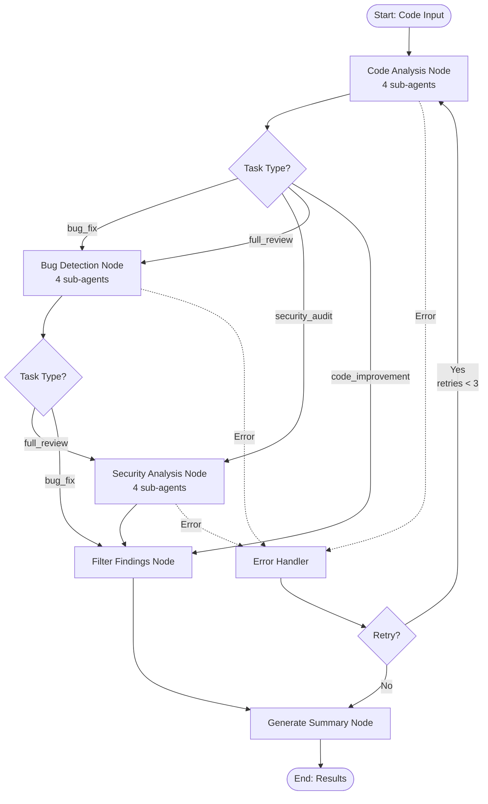

# LangGraph Integration Guide

## 🎯 What is LangGraph?

LangGraph is a library for building stateful, multi-agent workflows with:

- **State Management**: Track workflow progress across nodes
- **Conditional Routing**: Dynamic paths based on state
- **Error Handling**: Automatic retries and graceful degradation
- **Checkpointing**: Save/resume workflow execution

## 🏗️ Architecture



## 📋 Workflow Nodes

### 1. **Code Analysis Node**

- Runs `CodeAnalysisAgent` (4 sub-agents in parallel)
- Collects findings in state
- Handles errors gracefully

### 2. **Bug Detection Node** (Conditional)

- Runs `BugDetectionAgent` (4 sub-agents)
- Only executes for `bug_fix` and `full_review` tasks
- Accumulates findings

### 3. **Security Analysis Node** (Conditional)

- Runs `SecurityAnalysisAgent` (4 sub-agents)
- Only executes for `security_audit` and `full_review` tasks
- Accumulates findings

### 4. **Filter Findings Node**

- Applies filter pipeline to all accumulated findings
- Deduplication, confidence filtering, hallucination check
- Reduces noise

### 5. **Generate Summary Node**

- Creates human-readable summary
- Aggregates statistics
- Formats suggestions

### 6. **Error Handler Node**

- Catches errors from any agent
- Implements retry logic (max 3 retries)
- Falls back to partial results if needed

## 🔧 State Management

LangGraph tracks state across all nodes using TypedDict:

```python
class CodeReviewWorkflowState(TypedDict):
    # Input
    code: str
    task_type: str

    # Agent results
    analysis_result: Optional[Dict[str, Any]]
    bug_result: Optional[Dict[str, Any]]
    security_result: Optional[Dict[str, Any]]

    # Accumulated findings (using Annotated[List, add])
    all_findings: List[Finding]
    filtered_findings: List[Finding]

    # Output
    summary: str
    suggestions: List[str]

    # Error handling
    errors: List[str]  # Accumulated errors
    retry_count: int
    max_retries: int
    status: str
```

**Key Feature**: `Annotated[List, add]` automatically **accumulates** findings from all nodes!

## 🚀 Usage

### Basic Usage

```python
from src.langgraph_workflows import run_code_review

code = """
def calculate(x, y):
    return x / y  # Division by zero!
"""

# Full review (all 12 agents)
result = run_code_review(code, task_type="full_review")

print(result['summary'])
print(f"Found {len(result['filtered_findings'])} issues")
```

### Advanced: Custom Configuration

```python
from src.langgraph_workflows import create_code_review_workflow

config = {
    "analysis": {
        "model": "qwen2.5-coder",
        "provider": "local",
        "temperature": 0.2,
        "confidence_threshold": 0.6
    },
    "bug_detection": {
        "model": "qwen2.5-coder",
        "provider": "local",
        "temperature": 0.1,
        "confidence_threshold": 0.7
    },
    "security": {
        "model": "qwen2.5-coder",
        "provider": "local",
        "temperature": 0.1,
        "confidence_threshold": 0.75
    },
    "filter": {
        "confidence_threshold": 0.6,
        "similarity_threshold": 85,
        "strict_evidence": False
    }
}

workflow = create_code_review_workflow(config)

initial_state = {
    "code": code,
    "task_type": "security_audit",
    "all_findings": [],
    "filtered_findings": [],
    "errors": [],
    "retry_count": 0,
    "max_retries": 3,
    "status": "pending"
}

final_state = workflow.invoke(initial_state)
```

### Task Types

| Task Type          | Agents Run                               | Use Case                        |
| ------------------ | ---------------------------------------- | ------------------------------- |
| `code_improvement` | Code Analysis only (4 agents)            | Quick code review, style checks |
| `bug_fix`          | Code Analysis + Bug Detection (8 agents) | Find and fix bugs               |
| `security_audit`   | Code Analysis + Security (8 agents)      | Security vulnerabilities        |
| `full_review`      | All 12 agents                            | Comprehensive review            |

## 🔄 Error Handling & Retries

LangGraph automatically handles errors:

1. **Agent fails** → Error captured in state
2. **Error Handler node** → Checks retry count
3. **If retries < 3** → Restart from Code Analysis
4. **If retries >= 3** → Skip to Summary with partial results

```python
# Automatic retry on failure
result = run_code_review(code, task_type="full_review")

if result['status'] == 'failed':
    print(f"Workflow failed after {result['retry_count']} retries")
    print(f"Errors: {result['errors']}")
else:
    print(f"Workflow completed successfully!")
```

## 💾 Checkpointing

LangGraph saves state at each node using `MemorySaver`:

```python
from langgraph.checkpoint.memory import MemorySaver

checkpointer = MemorySaver()
workflow = create_code_review_workflow(config).compile(checkpointer=checkpointer)

# Can now resume interrupted workflows!
```

## 📊 Benefits vs Direct Agent Calls

| Feature               | Direct Agents     | LangGraph Workflow               |
| --------------------- | ----------------- | -------------------------------- |
| **State Tracking**    | Manual            | ✅ Automatic                     |
| **Error Handling**    | Manual try/catch  | ✅ Built-in retries              |
| **Conditional Logic** | If/else spaghetti | ✅ Declarative routing           |
| **Partial Results**   | Lost on error     | ✅ Preserved in state            |
| **Visualization**     | N/A               | ✅ Graph visualization           |
| **Debugging**         | Print statements  | ✅ State inspection at each node |

## 🎨 Workflow Visualization

LangGraph can generate Mermaid diagrams:

```python
from langgraph.graph import StateGraph

workflow = create_code_review_workflow(config)
print(workflow.get_graph().draw_mermaid())
```

## 🔗 Integration with Orchestrator

Update your orchestrator to use LangGraph:

```python
# In orchestrator.py
from src.langgraph_workflows import run_code_review

def _handle_full_review(self, input_data: Dict[str, Any], task_id: str):
    """Use LangGraph workflow instead of manual coordination."""
    code = input_data.get("code", "")

    # Run LangGraph workflow
    result = run_code_review(code, task_type="full_review")

    return {
        "status": result.get("status"),
        "task_id": task_id,
        "summary": result.get("summary"),
        "findings": result.get("filtered_findings"),
        "suggestions": result.get("suggestions"),
        "errors": result.get("errors", [])
    }
```

## 📝 Example Output

```bash
$ python examples/langgraph_workflow_example.py

============================================================
LangGraph Code Review Workflow Example
============================================================

[1] Running FULL REVIEW (all 12 agents)...

Status: complete
Total findings: 6

Summary:
Code review found 6 issues:
- Critical: 1
- High: 2
- Medium: 3

By category:
- Data Exposure: 1
- Injection Vulnerability: 1
- Edge Case: 1
- Naming Convention: 2
- Type Error: 1

✅ Workflow demonstration complete!
```

## 🎯 Next Steps

1. **Test the workflow**:

   ```bash
   python examples/langgraph_workflow_example.py
   ```

2. **Integrate with orchestrator** (replace manual agent calls)

3. **Add GitHub PR workflow** (create `pr_review_workflow.py`)

4. **Customize routing logic** (add more conditional nodes)

5. **Add human-in-the-loop** (pause for approval before posting comments)

---

**Key Takeaway**: LangGraph transforms your sequential agent calls into a robust, stateful workflow with automatic error handling, retries, and conditional routing!
